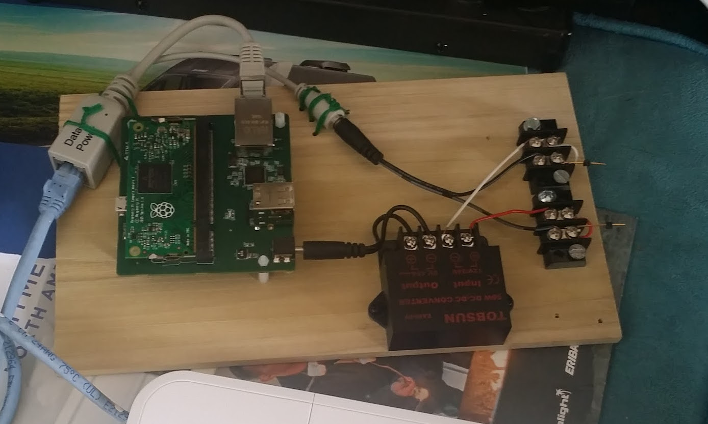

---

# Ubuntu Base on Raspberry Pi

---

---

1.    make_raspboot.sh    (do it once, then meant to be permanent)

              - Grabs raspbian-stretch-lite
                   - Writes the .img to SDcard

              - Gets the boot directory from the release
                   - Copies to local directory 'raspbian_boot'

              - removes all the OS-related files from boot
                   - *.dtb, kernel*.img, overlays/*

              - All that's left is the stuff needed to boot

2.    make_kernel.sh    (mostly permanent, may need to add stuff, drivers, etc)

              - GIT source

              - make everything, including modules
                   - kernel7.img, *.dtb, overlays/*.dtbo

3.    make_boot.sh      (only as often as the kernel changes)

              - Starts with everything from raspbian_boot

              - Adds all the stuff from kernel build
                      - kernel7.img, *.dtb, overlays/*.dtbo

              - Modifies cmdline.txt    (plus look at PARTUUID)

              - Modifies config.txt

              - Will copy to sdcard (/media/johnr/boot)
                      - make sure sdcard is inserted, formatted, and good to go

4.    make_rootfs.sh  (comments below are a bit dated as of 4/26 at midnight)

      Execute make_rootfs.sh as your normal user, not as root.  It will sudo at the appropriate spots

              - Starts with ubuntu core
                      - unzip/untar, keep file ownership

              - Add my 3 custom files (via 'cp'):  Allows for login in tty console
                      - /etc/init/serial-autodetect-console.conf
                      - /bin/serial-console
                      - /root/1stboot_config.sh

              - Add/Modify a few more files (via shell script):
                      - /etc/network/interfaces.d/lo
                      - /etc/network/interfaces.d/eth0
                      - /etc/passwd
                      - /etc/resolv.conf
                      - /etc/hostname
                      - /etc/fstab
                      - /root/.bashrc
                      - /etc/skel/.bashrc

              - Set up /etc/apt/sources.list for debian jessie
                      - sources.listORG, sources.listJESSIE

              - Copy in the modules from the kernel tree

              - Will copy to sdcard (/media/johnr/rootfs)
                      - make sure sdcard is inserted, formatted, and good to go

                      - Notes on Compute Module:
                          - place into gumstix 'Pi Fast Flash Board'
                          - mount filesystems using usbboot
                          - use gparted to format as needed (investigate mkfs.ext4)
                               - use gnome-disks to label 'rootfs'

5.    make_sdcard.sh

              - Starts with card image from raspbian-stretch-lite (for the disk formatting/partitioning)

              - delete ext4 partition, then create new one, then format  (use gparted for all this)
                      - 4, 3669, 48                                      (3669 is the magic sauce)

              - use 'gnome-disks' to label rootfs and boot as needed

              - empty boot.  rootfs should already be empty as the result of the reformatting

              - run make_boot.sh

              - run make_rootfs.sh, unmount/eject/physically remove

              - Insert into Pi.  Power on Pi3. Execute 1stboot_config.sh

6.    make_img.sh    (you can really do this any time with a card that boots)

              - Create .img from card using dd with special count

              - Take that .img and burn to RPI Compute Module

                            cd ~/usbboot
                            sudo ./rpitool

